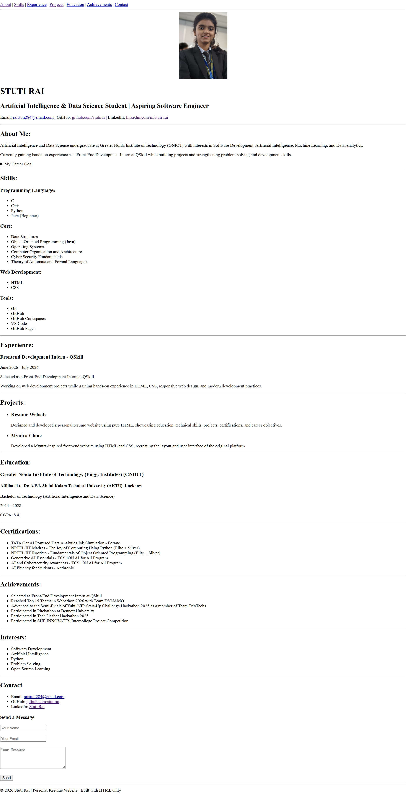

# HTML Resume

A personal resume website built using HTML.

## About the Project

This project is a digital version of my resume created using HTML. It presents my educational background, technical skills, projects, certifications, and contact information in a structured webpage format.

The goal of this project was to apply HTML concepts in a practical way and understand how information can be organized and displayed on a web page.

## Project Preview

  

## Features

* Personal profile section
* Education details
* Technical skills
* Certifications
* Projects section
* Contact information
* Structured and easy-to-read layout

## Technologies Used

* HTML5

## Learning Outcomes

Through this project, I learned:

* HTML document structure
* Semantic HTML elements
* Working with headings, lists, links, and images
* Organizing content on a webpage
* Creating a static website from scratch

## Author

**Stuti Rai**
- B.Tech, Artificial Intelligence & Data Science
- Aspiring Software Developer
- Learning Web Development
